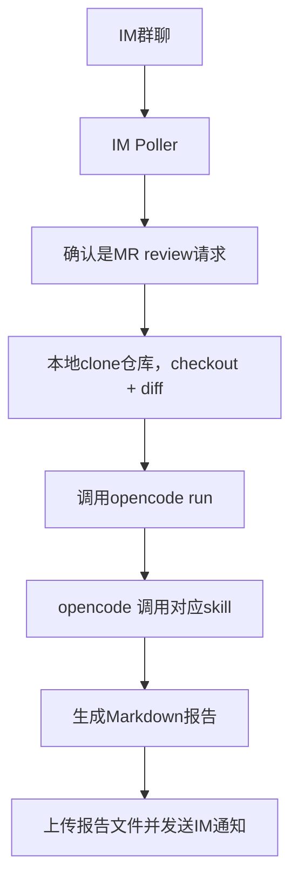

# 一、项目目标（MVP范围）

## 核心目标

构建一个 **IM 驱动的 AI MR Review 助手**：

```text
用户在企业IM中 @Bot + MR链接
→ Bot 自动触发 AI Review
→ 生成检视报告
→ 回发 IM
```

## MVP边界（强约束）

- ✅ 只生成 **Markdown 检视报告**
- ❌ 不自动提交 MR 评论（后续阶段再做）
- ✅ 支持完整仓库上下文（避免误判）
- ✅ 使用 opencode + skill 进行 review
- ❌ 不做复杂任务调度 / 分布式

------

# 二、总体架构



------

# 三、核心设计决策

## 1. 使用本地 clone + diff（关键）

原因：

- 避免“只看 diff”导致误判
- 可读取：
  - 调用链
  - 配置
  - 测试代码
  - 领域模型

该模式也是常见 AI Review 实践（CI 中直接 clone 仓库再分析 diff）([Martin Alderson](https://martinalderson.com/posts/using-opencode-in-cicd-for-ai-pull-request-reviews/?utm_source=chatgpt.com))

------

## 2. diff策略（必须这样做）

禁止：

```bash
git diff target..source
```

必须：

```bash
git diff <merge-base>...<source-commit>
```

原因：

- MR语义是“相对于共同祖先的变化”
- 避免引入无关变更

------

## 3. Skill 使用策略

关键点：

- Skill 不可靠自动触发 → **必须显式指定使用**（实践经验）
- Skill 本质是 **可复用的 prompt 模板** ([OpenCode](https://opencode.ai/docs/skills/?utm_source=chatgpt.com))

------

# 四、MVP 技术选型

## 推荐组合

| 模块     | 技术                |
| -------- | ------------------- |
| IM Bot   | Python CLI + WeLink CLI |
| AI Agent | opencode CLI（MVP） |
| Skill    | code-review skill   |
| Git 操作 | 原生 git CLI        |
| 存储     | 本地 JSON 状态文件  |

------
# 五、关键约束（必须实现）

## 1. 安全

```text
群白名单
用户白名单
仓库白名单
MR域名校验
```

------

## 2. 资源控制

```text
最大文件数：50
最大diff行数：2000
最大执行时间：15分钟
```

------

## 3. 清理机制

```bash
删除任务临时目录：/tmp/code-review/task-xxx
```

必须在：

- 正常结束
- 异常失败
- 超时

都执行

------

## 4. 日志（必须）

```text
任务ID
MR链接
仓库
执行时间
结果状态
错误信息
```

------

# 七、Skill 设计（关键）

## code-review skill 要点

必须包含：

```yaml
name: code-review
description: review merge request for code quality and bugs
```

内容要约束模型：

```text
- 保守 review（减少误报）
- 必须验证问题
- 不要评论风格问题
- 输出结构化报告
```

参考实践：强调“90%置信度才输出问题”可显著降低噪音 ([Martin Alderson](https://martinalderson.com/posts/using-opencode-in-cicd-for-ai-pull-request-reviews/?utm_source=chatgpt.com))

------

# 八、阶段规划

## 阶段 1（当前目标）

-  IM触发
-  clone仓库 + diff
-  opencode review
-  返回报告

------

## 阶段 2

- 提交 MR 评论
- JSON结构化输出
- 行号定位

------

# 九、成功标准（MVP验收）

满足以下即完成：

```text
1. 在IM中@bot + MR链接
2. 5~10分钟内返回review报告
3. 报告包含：
   - 文件级问题
   - 行号
   - 风险分类
4. 报告可读且问题基本有效（非胡说）
```

------

# 十、关键风险（必须认知）

| 风险        | 说明               |
| ----------- | ------------------ |
| Review误报  | 必须用“保守策略”   |
| 大仓库慢    | 后续用 mirror 优化 |
| 权限问题    | Git访问是首要阻塞  |
| Skill不触发 | 必须显式调用       |
| Token成本   | 长diff会增加成本   |
