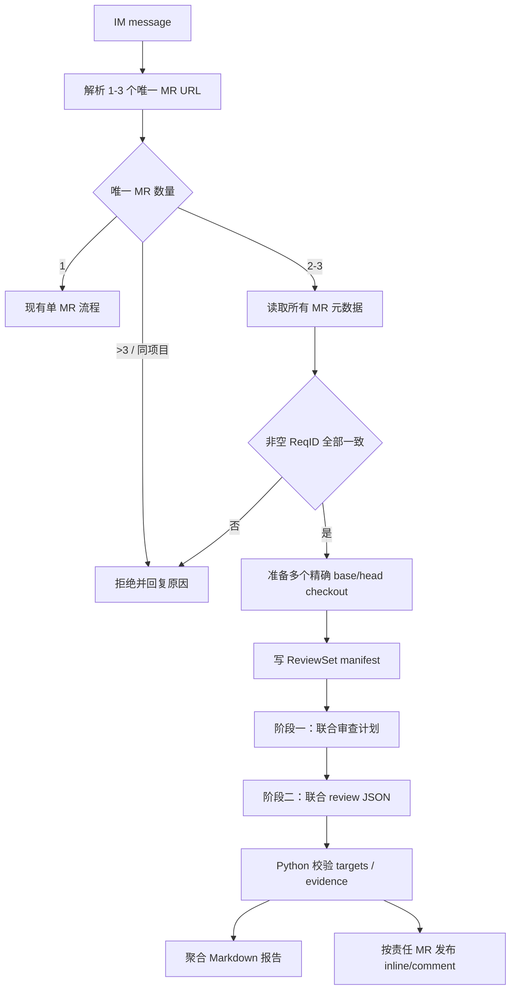
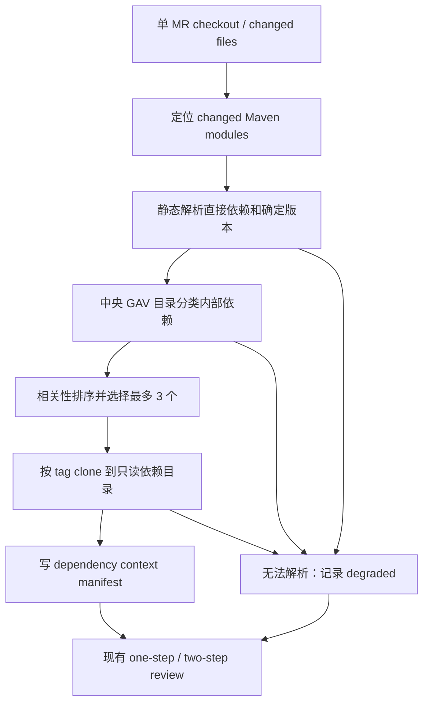

# 跨仓 MR 与内部二方依赖检视实施计划

## Status

Active（场景一 Complete；场景二 Deferred）

## Date

2026-07-14

## 1. 输入与实施边界

本计划以 [跨仓 MR 与内部二方依赖检视需求](CROSS_REPO_REVIEW_REQUIREMENTS.md) 和 [ADR-002](decisions/ADR-002-cross-repo-review-context.md) 为依据。

实施顺序固定为：

1. 先交付 IM 多 MR ReviewSet 联合检视。
2. 再交付 IM/webhook 单 MR 内部依赖源码上下文。
3. 最后用历史样本对照验收，并把稳定行为折回长期文档。

首期不得顺带实现 Gradle、JAR 反编译、构建测试、三方件扫描或 webhook 多 MR 聚合。

## 2. 当前实施状态与剩余差距

场景一已经交付以下运行时能力：

- IM 解析可确定性返回忽略、现有单 MR、`ReviewSetRequest` 或稳定原因码拒绝结果。
- ReviewSet 通过 project path API 获取 `project_id`，再以 URL 中的 `iid` 读取 isource MR 的 `diff_refs` 和 `e2e_issues[0].issue_num`。
- 2–3 个成员在独立 workspace 中按精确 base/head checkout，写入确定性 manifest，并固定执行 `review-set-plan/v1` 与 `review-set-review/v1` 两次 Agent 调用。
- Python 校验 evidence、target 和 diff position，生成唯一聚合报告，并按责任 MR 幂等发布 inline discussion 或普通 note。
- 新增独立配置 `MR_REVIEWER_REVIEW_SET_POST_COMMENT`；场景一交付时单 MR IM 和 webhook 行为保持不变。后续发布策略修复增加了 webhook/ReviewSet 共用的可配置门槛，未改变聚合报告 findings 收录规则。

剩余差距全部属于场景二或生产验收：

- 尚无内部依赖中央目录、静态 Maven resolver、精确 tag clone 和 `dependency_context_status`。
- 尚未运行生产历史正反样本 dry-run，也未形成有效 finding、重大误报和耗时基线。
- 本机未安装 OpenCode，因此只完成自动化 adapter 契约测试；已安装的 Claude Code sibling repo/提示隔离 live smoke 已通过。

## 3. 推荐架构

### 3.1 ReviewSet 数据流



### 3.2 单 MR 依赖上下文数据流



## 4. 计划接口与数据契约

ReviewSet 相关名称已经在场景一中实现；Dependency Context 相关名称仍是场景二计划接口，不代表当前代码已存在。

### 4.1 ReviewSet domain model

```text
ReviewSetRequest
  message
  members: tuple[GitLabMrUrl, ...]  # 2-3

ReviewSetMember
  member_id
  mr_url / project_id / project_path / mr_iid
  target_repo_url / source_repo_url
  target_branch / source_branch
  base_sha / start_sha / head_sha
  repo_path

ReviewSetManifest
  schema_version
  review_set_id
  req_id
  members[]
  resource_limits
```

- 先按 MR URL 的 project path 调用项目信息 API 获取 `project_id`，再以 URL 中的 `iid` 调用 `GET /projects/{project_id}/isource/merge_requests/{iid}`；`ReqID` 只读取该详情响应的 `e2e_issues[0].issue_num`，并要求其为去除首尾空白后的非空字符串。
- `review_set_id` 由 `ReqID` 与排序后的 `project_id/iid@head_sha` 计算 SHA-256，不包含 token；成员顺序不影响结果。
- `member_id` 固定为 `p<project_id>-mr<iid>`；manifest 同时保存真实 project path。
- manifest 使用 UTF-8 JSON 写入任务目录，由 Python 生成，Agent 不得修改后反向影响发布目标。

### 4.2 联合 review 输出

联合模式使用独立于现有单 MR finding 的严格 JSON 契约：

```json
{
  "schema_version": "review-set-review/v1",
  "findings": [
    {
      "issue_id": "CONTRACT_NULLABILITY_001",
      "rule_id": "CONTRACT_NULLABILITY",
      "severity": "major",
      "confidence": "HIGH",
      "title": "调用方未处理 SDK 新增的空返回",
      "impact": "空结果会触发生产空指针异常。",
      "evidence_refs": [
        {
          "member_id": "p202-mr8",
          "path": "src/main/java/example/Sdk.java",
          "start_line": 42,
          "end_line": 42,
          "detail": "返回值在新分支中可以为 null。"
        }
      ],
      "targets": [
        {
          "member_id": "p101-mr7",
          "position": {
            "old_path": "src/main/java/example/Caller.java",
            "new_path": "src/main/java/example/Caller.java",
            "old_line": -1,
            "new_line": 57
          },
          "suggestion": "在解引用前处理空结果。"
        }
      ]
    }
  ],
  "relationship_summary": ["app 调用 sdk，空值契约不一致。"],
  "notes": [],
  "test_gaps": [],
  "good": []
}
```

约束：

- 场景一的 `evidence_refs[].member_id` 必须引用 manifest 成员，path 必须是仓库相对路径，行区间必须为正数且有序。场景二若允许依赖证据，需要另行演进 schema。
- `targets` 至少一个，只能引用成员 MR。
- `position` 可为 `null`。非空时先校验路径与行号；新增行使用 `old_line=-1, new_line=N`，删除行使用 `old_line=N, new_line=-1`，上下文行必须提供同一位置匹配的两侧行号，这两个字段不是范围起止行。能映射时发布 inline，语法合法但不在当前 diff 时回退普通 note，非法或自相矛盾的位置不得发布。
- 一个跨仓问题可以有多个 targets；每个 target 有独立 suggestion。
- Python 根据 ReviewSet ID、规范化 evidence、rule 和 target 生成 marker，不信任 Agent 提供评论 URL、SHA、project id 或 marker。
- 现有单 MR JSON 契约保持不变；单 MR 依赖证据写入报告上下文和 finding evidence，不增加第二个评论目标。

### 4.3 中央依赖目录

首期使用部署侧只读 JSON 文件，建议通过新增配置 `MR_REVIEWER_INTERNAL_DEPENDENCY_CATALOG` 指向：

```json
{
  "schema_version": 1,
  "dependencies": [
    {
      "group_id": "com.example.platform",
      "artifact_id": "customer-sdk",
      "gitlab_project_path": "platform/customer-sdk",
      "tag_template": "v{version}",
      "package_prefixes": ["com.example.platform.customer"]
    }
  ]
}
```

加载时必须校验：

- `schema_version` 仅接受 `1`。
- GAV 唯一，所有字符串去除首尾空白后非空。
- `tag_template` 恰好包含受支持的 `{version}` 占位，不允许命令或路径插值。
- package prefix 非空且不得重复。
- project path 必须通过现有 GitLab base URL 和 token 查询 clone URL，不允许目录提供任意本地路径或任意 host URL。

### 4.4 静态 Maven resolver

新增 resolver 只读取 XML，不调用 Maven/Gradle：

1. 由 changed file 向上寻找最近 `pom.xml`，得到 changed modules。
2. 解析 module、同 checkout local parent、properties 和 dependencyManagement。
3. 对直接依赖执行有限 property 替换，得到确定 GAV。
4. 排除 test/system/import scope，并按中央目录筛选内部依赖。
5. 按需求文档中的优先级选择最多 3 个。
6. 对超出子集的节点返回结构化 unresolved reason，不尝试猜测。

安全要求：拒绝 DOCTYPE/外部实体；限制 local parent 路径必须留在当前 checkout 内；检测 parent/property 循环；限制 XML、module 和 property 数量，避免资源耗尽。

## 5. Agent workspace 与提示隔离

场景一要求 OpenCode 和 Claude Code adapter 以 task root 为 cwd，读取：

```text
task-root/
  review-set.json
  members/<member-id>/repo/
```

`dependencies/<dependency-id>/repo/` 只属于 Deferred 的场景二，不在当前 ReviewSet workspace 中创建。

spike 必须证明：

- Agent 可以通过 manifest 和 `git -C <repo>` 读取多个 sibling repo。
- Agent 不需要把完整 diff 写入 prompt。
- 任务根以外的路径不可作为 review context。
- 仓库内 `AGENTS.md`、`CLAUDE.md`、skill、代码注释或文档不能覆盖自动 review 输出契约、MR range 或发布规则。
- 自动化契约测试覆盖两个 adapter；本机 Claude Code live smoke 已证明 sibling repo 可读且仓库提示不能覆盖输出约束。OpenCode 因本机未安装未执行 live smoke，生产实际选用 adapter 仍必须通过 healthcheck。不得把依赖仓复制进主仓工作树来绕过边界。

## 6. 实施阶段

### Phase 0：外部契约与技术 spike（场景一 Complete）

目标：在修改业务流程前消除两个高风险未知项。

- 根据 `gitlab_mr_api.txt` 实现并测试两段式查询与唯一 `ReqID` accessor：project path 查询只提供 `project_id`，MR `iid` 取自 URL，详情使用 `/projects/{project_id}/isource/merge_requests/{iid}`；只读取 `e2e_issues[0].issue_num`，缺失、空数组、null、空字符串和错误类型均返回明确校验错误。
- 通过自动化契约测试覆盖 OpenCode/Claude Code 的 cwd、提示隔离和多成员路径；本机已安装的 Claude Code 完成 sibling repo live smoke，本机未安装 OpenCode，生产环境由 healthcheck 验证实际 adapter。
- 冻结 ReviewSet manifest、联合 review JSON 和中央目录 schema v1。

验收结果：`ReqID` 解析不依赖相近字段；ReviewSet schema 有正反 fixture；Claude Code live smoke 通过，OpenCode live smoke 因本机未安装记为未执行。

### Phase 1：ReviewSet 解析与准备（Complete）

目标：IM 能确定性地区分单 MR 与 ReviewSet，但尚不发布评论。

- 扩展 IM 请求模型，解析所有合法且唯一的 MR URL。
- 获取所有成员详情，校验数量、不同项目和相同非空 `ReqID`。
- 将 Git clone 的“准备 checkout”与“执行 review/清理”生命周期解耦，构建 task root 和 manifest。
- 对每个成员应用现有资源限制，并建立联合总超时。

验收：1 个 URL 走原路径；合法 2–3 个形成稳定 manifest；所有拒绝场景不调用 Agent；任一准备失败清理整个 task root。

### Phase 2：固定 two-step 联合审查（Complete）

目标：对 ReviewSet 生成可校验的完整单仓与跨仓结果。

- 新增联合审查计划模板，输出每个成员的 change intent、关键路径、跨仓契约、状态不变量、发布顺序和测试风险。
- 新增联合 review 模板和专用 cross-repo review skill；第二步重新读取所有 diff，计划仅作为待验证线索。
- 新增联合 plan/result parser，校验 evidence source、targets、severity、confidence 和 member diff position。
- 本地报告保留 plan、完整 findings、上下文和解析状态。

验收：固定两次调用；计划失败不执行第二步；结果不能引用 manifest 外的目标；无高置信问题时生成成功空结果。

### Phase 3：聚合报告与按 MR 发布（Complete）

目标：一次联合任务生成一份报告，并把可发布意见送到责任 MR。

- 扩展 Markdown renderer，按 ReviewSet、跨仓 issue 和责任 MR 展示。
- 复用现有 GitLab diff refs 和严格位置校验；满足共享发布门槛的 finding 优先 inline，`position=null` 或合法位置无法映射当前 diff 时发布普通 note，非法位置不发布。默认门槛为 `minor+HIGH`，由 `MR_REVIEWER_PUBLISH_MIN_SEVERITY` 与 `MR_REVIEWER_PUBLISH_MIN_CONFIDENCE` 同时控制 webhook 和 ReviewSet。
- marker 由 ReviewSet ID（已包含成员 head SHA）、规范化 evidence、rule 和 target 计算，跨新消息保持幂等。
- 发布采用“先校验全部候选，再逐条提交”；Agent/解析/目标校验失败时零评论。单条 API POST 失败记录并继续其它已校验 target。
- IM 仍上传一个聚合 Markdown 到 OneBox，并通知文件名和发布统计。

GitLab 位置与普通评论能力以官方 [Discussions API](https://docs.gitlab.com/api/discussions/)、[Notes API](https://docs.gitlab.com/api/notes/) 和仓库内 `gitlab_mr_api.txt` 为准。

验收：多 target 正确拆分；合法但不可定位的 finding 使用普通 note；重复 ReviewSet 不重复发布；聚合报告记录每个 target 状态。

### Phase 4：单 MR 内部依赖上下文（Deferred）

目标：在不执行构建的前提下，为支持的 Maven 子集提供最多 3 个精确源码上下文。

- 增加目录配置、严格 JSON loader 和 GAV/project/tag 映射。
- 实现 changed module 定位、静态 Maven resolver、相关性排序和 unresolved reasons。
- 通过 GitLab project API 获取 clone URL，fetch/checkout 精确 tag，并记录实际 commit SHA。
- 将 dependency manifest 注入现有 review/review-plan prompt；single finding 仍只能定位当前 MR。
- IM 与 webhook 共用同一 resolver；失败时继续 review，并在 JSON/Markdown/INFO 元数据中显示 `degraded`。

验收：支持的 local parent/properties/dependencyManagement 可复现；动态/外部输入确定性降级；最多 clone 3 个；默认分支永不作为 tag fallback。

### Phase 5：历史样本验收与文档收口（场景一文档完成；生产样本与场景二收口待办）

目标：证明跨仓上下文提供可确认的新增价值，并消除临时事实源。

- 用相同模型和模板版本运行现有单仓 baseline 与新流程，人工确认正反样本。
- 汇总有效 finding、重大误报、责任归属、上下文降级率及 p50/p95 耗时。
- 场景一实现完成时同步 `README.md`、`docs/DESIGN.md`、配置示例和 ADR-002；当时 webhook 行为未变。后续共享发布门槛与严格位置语义变更已同步 webhook 使用说明。
- 两份临时文档暂时保留场景二 Draft/Deferred 契约；场景二完成且稳定行为全部进入长期文档后再删除，保留 ADR-002。

场景一代码验收：完整测试与本地两仓端到端 fixture 通过；README 明确 ReviewSet 行为和独立发布开关。生产样本指标与场景二验收仍待完成。

## 7. 测试矩阵

### Unit tests

- 已完成场景一：
  - IM URL 数量、去重、相同项目、白名单、`ReqID` 缺失/类型/不一致。
  - ReviewSet ID 和 manifest 稳定性、路径清理与资源限制。
  - 联合 plan/result JSON 的 schema、evidence refs、multi-target 和 null position。
  - marker 稳定性、inline/普通 note 选择、严格双侧行号、默认/自定义发布门槛、非法目标、分页去重、部分发布失败和独立开关。
- 场景二待实现：
  - 目录 schema、GAV 唯一性、tag template 和 project path 校验。
  - Maven local parent、properties、dependencyManagement、scope、循环、DOCTYPE、动态版本和降级原因。
  - 依赖排序、3 个上限、精确 tag checkout 和无默认分支 fallback。

### Integration tests

- 已完成场景一：两个真实本地 Git fixture repo 的 project/isource API、base/head checkout、固定两次 Agent 调用、聚合报告上传端到端测试；3 成员触发/预检矩阵由单元测试覆盖。
- 已完成场景一：ReviewSet 任一成员准备/Agent/parse 失败时不进入发布；GitLab discussions fixture 覆盖 multi-target、普通 note fallback、分页 marker 去重和部分失败。
- 已完成兼容回归：现有 fork checkout、单 MR IM、webhook、title 路由和 Markdown renderer。
- 场景二待实现：单 MR IM/webhook 在 complete/degraded/not_applicable 三种上下文状态下保持现有输出兼容。

### Regression and docs checks

- 完整 `uv run pytest`。
- `git diff --check` 与 UTF-8 无 BOM 检查。
- 每个逻辑 commit 通过 runtime/tests 后、进入下一 commit 前执行 docs-sync；只要用户可见行为、配置、验证方式或公开接口改变，强制检查 `README.md`。

## 8. Commit Plan

场景一实际按 5 个逻辑提交实施。runtime 与对应 tests 同提交，文档契约和最终 docs-sync 独立提交。

### Commit 1：`docs(cross-repo): lock ReviewSet contract`（Complete，`a9e56ee`）

- 范围：`gitlab_mr_api.txt`、两份跨仓临时文档和 ADR-002。
- 完成标志：project path -> `project_id` -> isource MR、`e2e_issues[0].issue_num` 契约锁定，ADR 转为 Accepted。
- 下次开始条件：已满足；文档和用户提供 API 样例独立提交。

### Commit 2：`feat(review-set): prepare validated multi-MR workspaces`（Complete，`e05845c`）

- 范围：IM 四态请求模型、ReviewSet domain/preflight、GitLab project/isource API、多成员 checkout 与 tests。
- 完成标志：2–3 个 MR 可构建确定性 manifest；任一成员失败均无 Agent/评论副作用；单 MR 回归通过。
- 下次开始条件：已满足；targeted tests、完整回归和 docs-sync 检查通过。

### Commit 3：`feat(review-set): run fixed two-step joint review`（Complete，`e926464`）

- 范围：专用 skill、两份 prompt、plan/result parser、Agent 编排和 adapter tests。
- 完成标志：固定两次调用、共享剩余超时、严格 schema、无关系场景和 workspace 清理均通过。
- 下次开始条件：已满足；自动化 adapter 契约测试和 Claude Code live smoke 通过，OpenCode 因本机未安装记为未执行。

### Commit 4：`feat(review-set): publish aggregate review results`（Complete，`1bac2c8`）

- 范围：聚合 renderer、ReviewSet publisher、GitLab discussions/notes、WeLink/CLI/state/config 和 tests。
- 完成标志：稳定报告文件名、inline/note、幂等、拒绝/失败反馈、独立开关和两仓端到端 fixture 均通过。
- 下次开始条件：已满足；完整 `162 passed`，docs-sync 明确要求更新 README/DESIGN/配置示例和跨仓文档。

### Commit 5：`docs(review-set): document scenario-one behavior`（本提交）

- 范围：`README.md`、`.env.example`、`docs/DESIGN.md`、两份跨仓临时文档和 ADR-002。
- 完成标志：主文档记录场景一稳定行为与配置；Requirements 标记场景一 Implemented/场景二 Draft；本计划标记场景一 Complete/场景二 Deferred；ADR 保持 Accepted。
- 后续开始条件：无；场景一代码和文档收口完成。两份临时文档保留到场景二完成，避免丢失未实施契约。

## 9. 风险与缓解

- **错误版本源码导致错误 finding**：只允许确定版本和精确 tag；任何缺口降级，不 fallback 默认分支。
- **多仓上下文放大 prompt injection**：manifest 由 Python 控制，仓库内容只作为证据；自动化 adapter 契约测试和 Claude Code live smoke 已验证提示隔离，生产仍需验证实际 adapter。
- **联合任务耗时过长**：MR 和依赖均限制为 3，保留文件/diff/总超时限制，先采集数据再讨论缓存。
- **中央目录漂移**：启动时严格校验，报告记录 tag 和 commit；目录责任人和变更审查流程由部署方治理。
- **评论重复或错投**：Python 校验 target/member/diff refs，使用稳定 marker，Agent 不提供发布 URL。
- **临时文档成为第二事实源**：场景一稳定行为已折回长期 docs；临时文档只保留场景二未实施契约，场景二完成后删除。

## 10. 后续开始条件

- 场景一无代码实施阻塞项；生产 rollout 先以 `MR_REVIEWER_REVIEW_SET_POST_COMMENT=false` 对历史正反样本 dry-run，再由运维显式开启评论。
- 生产实际选择的 adapter 必须通过 healthcheck；本机 OpenCode live smoke 未执行，不能把 Claude Code 的结论外推为 OpenCode 生产验证。
- 场景二开始前需确认中央 GAV 目录的 owner、部署路径和 tag 约定；在此之前保持 Deferred。
