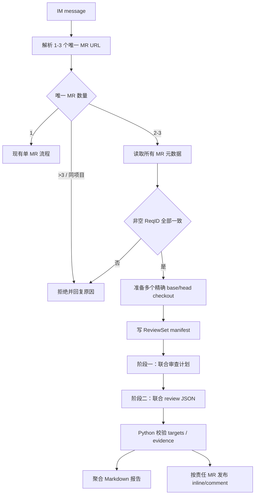
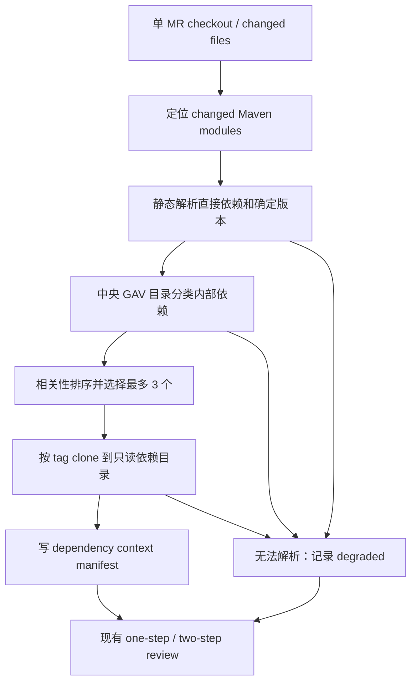

# 跨仓 MR 与内部二方依赖检视实施计划

## Status

Draft（仅规划，功能尚未实施）

## Date

2026-07-12

## 1. 输入与实施边界

本计划以 [跨仓 MR 与内部二方依赖检视需求](CROSS_REPO_REVIEW_REQUIREMENTS.md) 和 [ADR-002](decisions/ADR-002-cross-repo-review-context.md) 为依据。

实施顺序固定为：

1. 先交付 IM 多 MR ReviewSet 联合检视。
2. 再交付 IM/webhook 单 MR 内部依赖源码上下文。
3. 最后用历史样本对照验收，并把稳定行为折回长期文档。

首期不得顺带实现 Gradle、JAR 反编译、构建测试、三方件扫描或 webhook 多 MR 聚合。

## 2. 现有架构差距

当前实现的关键单仓假设包括：

- `ReviewRequest` 只保存一个 `mr`，IM 解析找到第一个合法 URL 即返回。
- `ReviewService` 在一个 task directory 中 clone 一个 `repo`，完成后立即清理。
- prompt、`code-review` skill 和结构化 finding 都只描述一个 base/head、一个 repo 和一个评论目标。
- IM poll 只生成并上传本地 Markdown；webhook inline 发布逻辑只面向一个 MR。
- `Config` 没有内部依赖目录、ReviewSet 数量或依赖上下文状态。

因此不能用“给现有 prompt 多加几个路径”完成本需求。必须先引入 ReviewSet domain model 和确定性的上下文 manifest，再扩展 Agent 契约和发布编排。

## 3. 推荐架构

### 3.1 ReviewSet 数据流



### 3.2 单 MR 依赖上下文数据流



## 4. 计划接口与数据契约

以下名称是计划中的内部接口，不代表当前代码已存在。

### 4.1 ReviewSet domain model

```text
ReviewSetRequest
  message
  members: tuple[GitLabMrUrl, ...]  # 2-3

ReviewSetMember
  member_id
  mr_url / project_path / mr_iid
  req_id
  target_repo_url / source_repo_url
  target_branch / source_branch
  base_sha / head_sha
  repo_path

ReviewSetManifest
  schema_version
  review_set_id
  req_id
  members[]
  resource_limits
```

- `review_set_id` 由 `ReqID` 与按 project path 排序后的 `project/iid@head_sha` 计算，不包含 token。
- `member_id` 使用稳定、无路径穿越风险的短标识；manifest 保存真实 project path。
- manifest 使用 UTF-8 JSON 写入任务目录，由 Python 生成，Agent 不得修改后反向影响发布目标。

### 4.2 联合 review 输出

联合模式使用独立于现有单 MR finding 的严格 JSON 契约：

```json
{
  "findings": [
    {
      "issue_id": "CONTRACT_NULLABILITY_001",
      "rule_id": "CONTRACT_NULLABILITY",
      "severity": "major",
      "confidence": "HIGH",
      "title": "调用方未处理 SDK 新增的空返回",
      "impact": "空结果会触发生产空指针异常。",
      "evidence_refs": [
        {
          "source_id": "member-sdk",
          "path": "src/main/java/example/Sdk.java",
          "line": 42,
          "detail": "返回值在新分支中可以为 null。"
        }
      ],
      "targets": [
        {
          "member_id": "member-app",
          "position": {
            "old_path": "src/main/java/example/Caller.java",
            "new_path": "src/main/java/example/Caller.java",
            "old_line": -1,
            "new_line": 57
          },
          "suggestion": "在解引用前处理空结果。"
        }
      ]
    }
  ],
  "notes": [],
  "test_gaps": [],
  "good": []
}
```

约束：

- `source_id` 必须引用 manifest 中的成员或依赖上下文。
- `targets` 至少一个，只能引用成员 MR；依赖 tag 不能成为评论目标。
- `position` 可为 `null`。非空时必须通过该成员 MR 的 diff 行校验；为 `null` 时只能发布普通 comment。
- 一个跨仓问题可以有多个 targets；每个 target 有独立 suggestion。
- Python 根据目标和位置生成 marker，不信任 Agent 提供评论 URL、SHA 或 project id。
- 现有单 MR JSON 契约保持不变；单 MR 依赖证据写入报告上下文和 finding evidence，不增加第二个评论目标。

### 4.3 中央依赖目录

首期使用部署侧只读 JSON 文件，建议通过新增配置 `MR_REVIEWER_INTERNAL_DEPENDENCY_CATALOG` 指向：

```json
{
  "schema_version": 1,
  "dependencies": [
    {
      "group_id": "com.example.platform",
      "artifact_id": "customer-sdk",
      "gitlab_project_path": "platform/customer-sdk",
      "tag_template": "v{version}",
      "package_prefixes": ["com.example.platform.customer"]
    }
  ]
}
```

加载时必须校验：

- `schema_version` 仅接受 `1`。
- GAV 唯一，所有字符串去除首尾空白后非空。
- `tag_template` 恰好包含受支持的 `{version}` 占位，不允许命令或路径插值。
- package prefix 非空且不得重复。
- project path 必须通过现有 GitLab base URL 和 token 查询 clone URL，不允许目录提供任意本地路径或任意 host URL。

### 4.4 静态 Maven resolver

新增 resolver 只读取 XML，不调用 Maven/Gradle：

1. 由 changed file 向上寻找最近 `pom.xml`，得到 changed modules。
2. 解析 module、同 checkout local parent、properties 和 dependencyManagement。
3. 对直接依赖执行有限 property 替换，得到确定 GAV。
4. 排除 test/system/import scope，并按中央目录筛选内部依赖。
5. 按需求文档中的优先级选择最多 3 个。
6. 对超出子集的节点返回结构化 unresolved reason，不尝试猜测。

安全要求：拒绝 DOCTYPE/外部实体；限制 local parent 路径必须留在当前 checkout 内；检测 parent/property 循环；限制 XML、module 和 property 数量，避免资源耗尽。

## 5. Agent workspace 与提示隔离 spike

正式实现前先验证 OpenCode 和 Claude Code adapter 是否能以 task root 为 cwd，读取：

```text
task-root/
  review-set.json
  members/<member-id>/repo/
  dependencies/<dependency-id>/repo/
```

spike 必须证明：

- Agent 可以通过 manifest 和 `git -C <repo>` 读取多个 sibling repo。
- Agent 不需要把完整 diff 写入 prompt。
- 任务根以外的路径不可作为 review context。
- 仓库内 `AGENTS.md`、`CLAUDE.md`、skill、代码注释或文档不能覆盖自动 review 输出契约、MR range 或发布规则。
- 任一 adapter 不满足时停止联合实现，记录限制；不得把依赖仓复制进主仓工作树来绕过边界。

## 6. 实施阶段

### Phase 0：外部契约与技术 spike

目标：在修改业务流程前消除两个高风险未知项。

- 根据用户补充的 GitLab API 文档实现并测试唯一 `ReqID` accessor；缺失、null、空字符串和错误类型均返回明确校验错误。
- 完成 OpenCode/Claude Code sibling repo 与提示隔离 spike。
- 冻结 ReviewSet manifest、联合 review JSON 和中央目录 schema v1。

验收：两个 adapter 的结论有可复现实验；`ReqID` 解析不依赖相近字段；schema 有正反 fixture。

### Phase 1：ReviewSet 解析与准备

目标：IM 能确定性地区分单 MR 与 ReviewSet，但尚不发布评论。

- 扩展 IM 请求模型，解析所有合法且唯一的 MR URL。
- 获取所有成员详情，校验数量、不同项目和相同非空 `ReqID`。
- 将 Git clone 的“准备 checkout”与“执行 review/清理”生命周期解耦，构建 task root 和 manifest。
- 对每个成员应用现有资源限制，并建立联合总超时。

验收：1 个 URL 走原路径；合法 2–3 个形成稳定 manifest；所有拒绝场景不调用 Agent；任一准备失败清理整个 task root。

### Phase 2：固定 two-step 联合审查

目标：对 ReviewSet 生成可校验的完整单仓与跨仓结果。

- 新增联合审查计划模板，输出每个成员的 change intent、关键路径、跨仓契约、状态不变量、发布顺序和测试风险。
- 新增联合 review 模板和专用 cross-repo review skill；第二步重新读取所有 diff，计划仅作为待验证线索。
- 新增联合 plan/result parser，校验 evidence source、targets、severity、confidence 和 member diff position。
- 本地报告保留 plan、完整 findings、上下文和解析状态。

验收：固定两次调用；计划失败不执行第二步；结果不能引用 manifest 外的目标；无高置信问题时生成成功空结果。

### Phase 3：聚合报告与按 MR 发布

目标：一次联合任务生成一份报告，并把可发布意见送到责任 MR。

- 扩展 Markdown renderer，按 ReviewSet、跨仓 issue 和责任 MR 展示。
- 复用现有 GitLab diff refs 和位置校验；HIGH major/fatal 优先 inline，`position=null` 时发布普通 comment。
- marker 加入 ReviewSet ID、成员 head SHA、rule/issue 和 target，跨新消息保持幂等。
- 发布采用“先校验全部候选，再逐条提交”；Agent/解析/目标校验失败时零评论。单条 API POST 失败记录并继续其它已校验 target。
- IM 仍上传一个聚合 Markdown 到 OneBox，并通知文件名和发布统计。

GitLab 位置与普通讨论能力以官方 [Discussions API](https://docs.gitlab.com/api/discussions/) 和仓库内 `gitlab_mr_api.txt` 为准。

验收：多 target 正确拆分；不可定位 finding 使用普通 comment；重复 ReviewSet 不重复发布；聚合报告记录每个 target 状态。

### Phase 4：单 MR 内部依赖上下文

目标：在不执行构建的前提下，为支持的 Maven 子集提供最多 3 个精确源码上下文。

- 增加目录配置、严格 JSON loader 和 GAV/project/tag 映射。
- 实现 changed module 定位、静态 Maven resolver、相关性排序和 unresolved reasons。
- 通过 GitLab project API 获取 clone URL，fetch/checkout 精确 tag，并记录实际 commit SHA。
- 将 dependency manifest 注入现有 review/review-plan prompt；single finding 仍只能定位当前 MR。
- IM 与 webhook 共用同一 resolver；失败时继续 review，并在 JSON/Markdown/INFO 元数据中显示 `degraded`。

验收：支持的 local parent/properties/dependencyManagement 可复现；动态/外部输入确定性降级；最多 clone 3 个；默认分支永不作为 tag fallback。

### Phase 5：历史样本验收与文档收口

目标：证明跨仓上下文提供可确认的新增价值，并消除临时事实源。

- 用相同模型和模板版本运行现有单仓 baseline 与新流程，人工确认正反样本。
- 汇总有效 finding、重大误报、责任归属、上下文降级率及 p50/p95 耗时。
- 实现完成后同步 `README.md`、`docs/DESIGN.md`、webhook/IM 使用说明、配置示例和 skill 文档。
- 行为与验收全部落入长期文档后，删除本 requirements 和 implementation plan；保留 ADR-002。

验收：需求文档第 8 节全部满足；README 不把降级任务描述为完整验证；临时文档删除后没有丢失用户可见契约。

## 7. 测试矩阵

### Unit tests

- IM URL 数量、去重、相同项目、白名单、`ReqID` 缺失/类型/不一致。
- ReviewSet ID 和 manifest 稳定性、路径清理与资源限制。
- 联合 plan/result JSON 的 schema、evidence refs、multi-target 和 null position。
- marker 稳定性、inline/普通 comment 选择和重复过滤。
- 目录 schema、GAV 唯一性、tag template 和 project path 校验。
- Maven local parent、properties、dependencyManagement、scope、循环、DOCTYPE、动态版本和降级原因。
- 依赖排序、3 个上限、精确 tag checkout 和无默认分支 fallback。

### Integration tests

- 2 个和 3 个本地 fixture repo 的 base/head 联合计划与 review 调用。
- fork MR 与普通 MR 混合的多 checkout。
- ReviewSet 任一成员准备/Agent/parse 失败时无部分评论。
- GitLab discussions fixture 下的 multi-target 发布、普通 comment fallback 和幂等。
- 单 MR IM/webhook 在 complete/degraded/not_applicable 三种上下文状态下保持现有输出兼容。

### Regression and docs checks

- 完整 `uv run pytest`。
- `git diff --check` 与 UTF-8 无 BOM 检查。
- 每个逻辑 commit 通过 runtime/tests 后、进入下一 commit 前执行 docs-sync；只要用户可见行为、配置、验证方式或公开接口改变，强制检查 `README.md`。

## 8. Commit Plan

预计变更会超过 10 个文件并混合 runtime、tests、skills 和 docs，必须分批 stage、验证和 commit。

### Commit 1：建立 ReviewSet 请求与元数据边界

- 范围：`im.py`、`gitlab.py`、新增 ReviewSet domain 模块及对应 tests。
- 完成标志：单/多 MR 路由、数量/项目/`ReqID` 校验和稳定 ID 全部通过；尚不调用联合 Agent。
- 下次开始条件：`ReqID` API fixture 已确认，拒绝路径不产生副作用，docs-sync 无遗漏。

### Commit 2：准备多仓 workspace 并生成联合结果

- 范围：`git.py`、review core、prompting/templates、专用 review skill、联合 plan/result parser 及 tests。
- 完成标志：fixture ReviewSet 固定 two-step，输出可验证 multi-target JSON，失败时完整清理。
- 下次开始条件：OpenCode/Claude Code spike 通过，完整 tests 通过，并完成 README/DESIGN docs-sync 判断。

### Commit 3：聚合报告与责任 MR 回写

- 范围：Markdown renderer、inline/comment publisher、IM/CLI 编排、幂等 marker、tests 和已生效的使用文档。
- 完成标志：一个聚合报告、按 target 回写、普通 comment fallback、重复过滤和发布审计均通过。
- 下次开始条件：端到端 ReviewSet fixture 通过，用户可见文档与实际行为一致。

### Commit 4：增加单 MR 内部依赖上下文

- 范围：config、catalog/Maven resolver 新模块、Git 精确 tag checkout、review core、tests 和配置文档。
- 完成标志：complete/degraded/not_applicable 三态可复现，最多 3 个依赖，默认分支不 fallback，现有单 MR 回归通过。
- 下次开始条件：完整 tests 通过，README/配置/验证方式 docs-sync 完成。

### Commit 5：历史样本验收与长期文档收口

- 范围：安全的测试 fixtures/结果摘要、`README.md`、`docs/DESIGN.md`、入口指南、skill 文档；删除临时 requirements/plan。
- 完成标志：历史样本结论可复核，长期文档成为唯一当前事实源，ADR-002 保留。
- 后续开始条件：只有在验收数据支持扩大范围时，才另行讨论 Gradle、CI resolved manifest、缓存或门禁。

## 9. 风险与缓解

- **错误版本源码导致错误 finding**：只允许确定版本和精确 tag；任何缺口降级，不 fallback 默认分支。
- **多仓上下文放大 prompt injection**：manifest 由 Python 控制，仓库内容只作为证据；先完成 adapter spike。
- **联合任务耗时过长**：MR 和依赖均限制为 3，保留文件/diff/总超时限制，先采集数据再讨论缓存。
- **中央目录漂移**：启动时严格校验，报告记录 tag 和 commit；目录责任人和变更审查流程由部署方治理。
- **评论重复或错投**：Python 校验 target/member/diff refs，使用稳定 marker，Agent 不提供发布 URL。
- **临时文档成为第二事实源**：功能完成后折回长期 docs 并删除 requirements/plan。

## 10. 阻塞项

- GitLab MR 详情 API 中 `ReqID` 的真实字段契约尚未提供。
- OpenCode/Claude Code 多 sibling repo 与提示隔离能力尚未验证。

这两个阻塞项解决前，可以实现无外部副作用的 domain/schema tests，但不得宣称生产联合检视可用。
