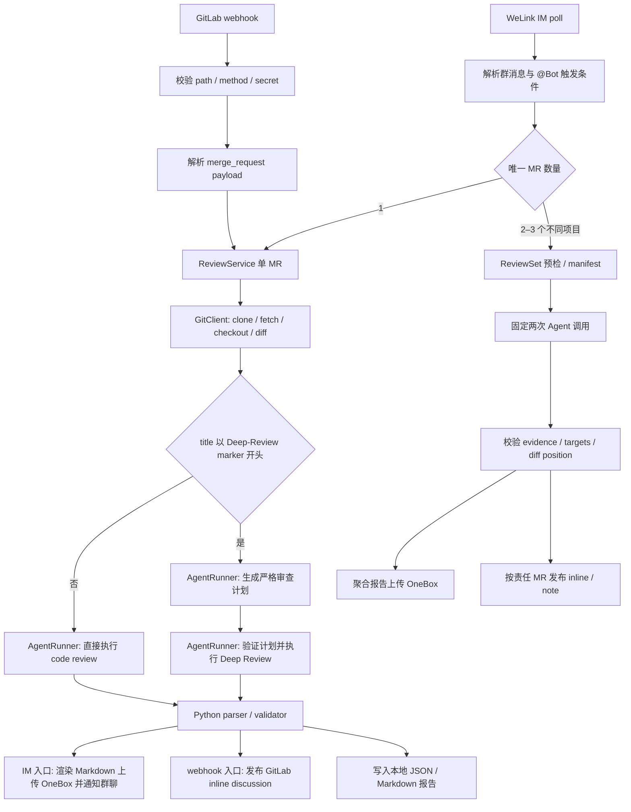
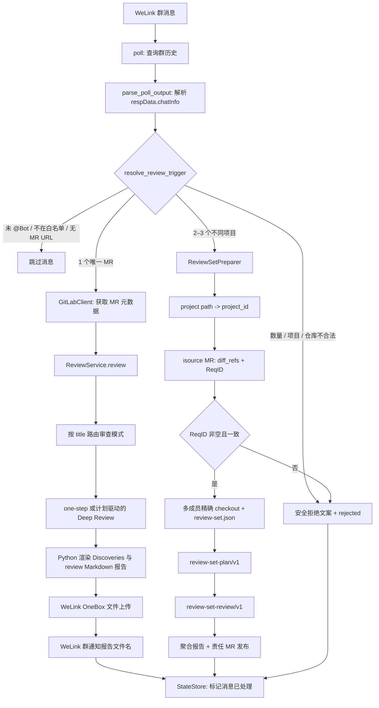
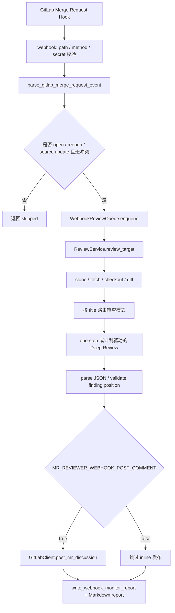

# 设计方案图

本项目有两类触发入口：WeLink IM poll 和 GitLab webhook。入口负责接收事件、过滤不可处理请求，然后把 GitLab MR 信息交给共用的 review core。单 MR review core 负责 clone/fetch/checkout、生成 diff，并根据最新 MR title 路由：普通 MR 执行 one-step review；`【Deep-Review】` 或 `[Deep-Review]` 完整前缀执行 two-step。匹配会去除 title 前导空白并忽略大小写，但不接受混合括号；`routing_marker` 记录命中形式对应的规范 marker。WeLink IM 还支持显式提交 2–3 个不同项目 MR 的 ReviewSet；该路径固定 two-step，不参与 title 路由。Python 侧负责信任边界校验、GitLab 发布和 Markdown 渲染。

## 总体结构



## WeLink IM poll 流程



## ReviewSet 契约与发布

ReviewSet 根目录固定为：

```text
<task-root>/
  review-set.json
  members/p<project-id>-mr<iid>/repo/
```

`project_id` 必须通过 MR URL 中的 project path 查询，`iid` 只取自 URL；生产 MR 详情读取 `/projects/{project_id}/isource/merge_requests/{iid}`。`ReqID` 只接受 `e2e_issues[0].issue_num` 的 trim 后非空字符串。manifest 包含 `schema_version`、完整 SHA-256 `review_set_id`、`req_id` 和成员 project/iid/base/start/head/repo path；成员顺序不影响 ID，head 变化会生成新 ID。

Agent 的第一阶段输出 `review-set-plan/v1`，第二阶段输出 `review-set-review/v1`。最终 finding 可以引用多个成员证据和多个责任 target，但 Agent 不能提供可信 URL、project id、SHA 或 marker。Python 在发布前校验全部 evidence/target：未知成员、越界路径或非法行号记为 `invalid`；合法位置不在当前 diff 时回退为普通 MR note。

webhook 与 ReviewSet 共用 `FindingPublicationPolicy`。默认发布 `minor` 及以上且 `confidence=HIGH` 的 target；部署侧可通过 `MR_REVIEWER_PUBLISH_MIN_SEVERITY` 与 `MR_REVIEWER_PUBLISH_MIN_CONFIDENCE` 调整，门槛只影响发布候选，不过滤报告 findings。marker 由 ReviewSet ID、规范化 evidence、rule 和 target 计算；分页读取 discussions 时，individual note 也参与去重。单目标 POST 失败不回滚其它已发布目标，状态转为 `success_with_warnings`。`MR_REVIEWER_REVIEW_SET_POST_COMMENT=false` 时只生成报告并把候选记为 `disabled`；开关开启但 `MR_REVIEWER_AGENT_MODEL_NAME` 为空时不发布，状态为 `success_with_warnings`。

聚合报告 basename 固定为 `review-set-<review_set_id 前 12 位>.md`，包含 ReqID、成员 refs、计划、关系结论、所有 findings、证据、责任位置和逐 target 发布状态。任务状态限定为 `rejected`、`failed`、`success` 或 `success_with_warnings`；拒绝和运行失败都以安全 IM 文案终结原消息，不自动重试。

## GitLab webhook 流程



## 结构化 Review 契约

自动入口要求 Agent 只输出 JSON，不输出 Markdown 或代码围栏。普通 MR 直接生成下面的结构化 finding。Deep Review 第一阶段严格生成 `change_intent`、`critical_paths`、`external_contracts`、`state_invariants`、`transaction_async_boundaries`、`test_risks`、`open_questions`；第二阶段把计划视为待验证线索，必须重新验证、允许推翻并覆盖计划遗漏。计划进入本地 JSON/Markdown 报告，但不进入 GitLab comment/discussion。

顶层结构：

```json
{
  "findings": [
    {
      "rule_id": "SQL_PERFORMANCE",
      "severity": "major",
      "confidence": "HIGH",
      "old_path": "src/example.py",
      "new_path": "src/example.py",
      "old_line": -1,
      "new_line": 42,
      "title": "批量查询缺少数量限制",
      "evidence": "本次变更新增 IN 查询，但未限制集合大小。",
      "suggestion": "限制集合大小或拆批查询。"
    }
  ],
  "notes": [],
  "test_gaps": []
}
```

字段约束：

- `severity` 使用 GitLab discussions API 枚举：`suggestion`、`minor`、`major`、`fatal`。
- `confidence` 只能是 `HIGH`、`MEDIUM`、`LOW`。
- 新增行使用 `old_line=-1, new_line=N`；删除行使用 `old_line=N, new_line=-1`。
- diff 中未修改的上下文行同时提供该位置匹配的 `old_line` 和 `new_line`；两者必须命中同一个上下文位置。
- 两个行号表示一个 GitLab diff 位置，不是范围的开始与结束。`0`、小于 `-1`、双 `-1`，以及任一侧命中 diff 但两侧无法对应同一个上下文位置的组合均非法，不发布也不回退普通 note。
- `old_path` / `new_path` 使用 GitLab diff 中的路径；重命名时分别填旧路径和新路径。
- `evidence` 和 `suggestion` 必须非空，否则 finding 不进入发布候选。

## Inline 发布规则

webhook 发布前会读取 GitLab MR 详情 API 的 `diff_refs.base_sha`、`diff_refs.start_sha`、`diff_refs.head_sha`，并基于 MR diff 构建可评论行集合。本地 `merge-base` 只用于 clone/diff fallback，不作为 inline discussion position 的权威来源。

发布门槛按固定顺序比较：severity 为 `suggestion < minor < major < fatal`，confidence 为 `LOW < MEDIUM < HIGH`；默认最低值分别是 `minor` 和 `HIGH`。配置值必须使用现有枚举，非法值在 `Config` 初始化时失败。`healthcheck` 输出实际门槛。低于任一门槛的 finding 分别标记 `below_min_severity` 或 `below_min_confidence`。

webhook 仅发布同时满足门槛并能映射到规范 diff 位置的 finding。低于门槛、无法映射到 diff 行、缺少证据或建议的 finding 只进入本地 JSON / Markdown 报告；不会为了发布而借用邻近变更行。ReviewSet 对语法合法但不在当前 diff 的位置继续回退普通 note，自相矛盾或非法位置不回退。

发布前会读取远端 discussions 中的 marker，避免重复 webhook 触发时刷屏。marker 格式：

```markdown
<!-- ai-cr:finding:{project}:{mr_iid}:{head_sha}:{rule_id}:{old_path}:{new_path}:{old_line}:{new_line} -->
```

`MR_REVIEWER_WEBHOOK_POST_COMMENT=false` 时不发布 inline discussion，但仍生成本地报告。webhook 不再通过 notes API 提交整段 Markdown note。

已知限制：webhook 的高风险、高置信非 diff finding 当前仍只保留本地。未来可以评估将其回退为普通 MR note，但本次设计未开放 Notes API，也未承诺具体启用条件。

## 本地报告与失败策略

webhook 每次 review 都写入同 stem 的机器可读 JSON 监视报告和人类可读 Markdown 报告：

```text
log/webhook-reports/20260709T120000Z-team_project-mr-7-webhook-abc123.json
log/webhook-reports/20260709T120000Z-team_project-mr-7-webhook-abc123.md
```

失败策略：

- 审查计划生成或校验失败：停止第二步，写 `failure_stage=review_plan` 的失败态报告。
- Deep Review 第二次 Agent 调用失败：保留已完成计划，写 `failure_stage=review` 的失败态报告。
- JSON parse failed：不发布 inline discussion，写 `parse_failed` 报告，并在 Markdown 中保留脱敏后的原始输出。
- finding 全部被过滤：不发布 inline discussion，写成功态本地报告。
- 读取远端 discussions 失败：不发布新 discussion，避免失去幂等后刷屏。
- 单条 discussion POST 失败：记录该 finding failed，继续处理其它 finding。
- Markdown 报告写入失败：任务标记 failed，因为本地 Markdown 报告是 webhook 可观测性的一部分。
- ReviewSet 任一预检、checkout、计划、review 或结构化解析失败：不进入 GitLab 发布；发送安全 IM 失败文案并将原消息标记 `failed`。
- ReviewSet 单个 target 发布失败：保留其它发布结果，在唯一聚合报告中记录失败并标记 `success_with_warnings`。

## 模块边界

MR Web URL 与 REST API root 是两个独立边界：`MR_REVIEWER_GITLAB_BASE_URL` 只用于 URL host 校验，`MR_REVIEWER_GITLAB_API_BASE_URL` 持有包含版本前缀的完整 API root；`GitLabClient` 只追加 `/projects/...` 资源路径。

- `cli.py`：命令入口、轮询循环和 review service 装配。
- `welink.py`：WeLink poll/reply 命令执行、OneBox 上传与群通知编排。
- `webhook.py`：GitLab webhook HTTP handler、secret 校验、payload 解析、后台队列、inline discussion 发布编排和本地报告写入。
- `im.py`：WeLink 历史消息解析、字段归一化，以及忽略/单 MR/ReviewSet/拒绝四态触发判断。
- `gitlab.py`：GitLab MR URL 解析、project path 到 project id 查询、MR/isource MR 元数据、项目 clone URL、分页 discussions、inline discussion 与普通 note API。
- `git.py`：临时 clone、fork remote 处理、分支 fetch、checkout、diff 与资源限制。
- `review_set.py`：ReviewSet 预检、ReqID/refs 信任边界、确定性 manifest 与多成员 workspace。
- `review_set_result.py` / `review_set_publish.py` / `review_set_report.py`：联合 plan/result 严格解析、责任 target 校验/幂等发布和聚合 Markdown。
- `reviewer.py`：共用 review core，串联 GitLab、Git 和 Agent；ReviewSet 固定两次调用并共享任务剩余超时预算。
- `review_result.py` / `inline_review.py` / `publication_policy.py` / `markdown_report.py`：审查计划与 review JSON 解析、finding 行定位校验、共享发布门槛、GitLab inline 发布结果整理和本地 Markdown 报告渲染。
- `opencode.py`：AgentRunner protocol、OpenCode/Claude Code adapter、debug 参数和 prompt 日志脱敏。
- `state.py`：IM poll 的本地去重状态文件，避免重复处理同一条 IM 消息。
