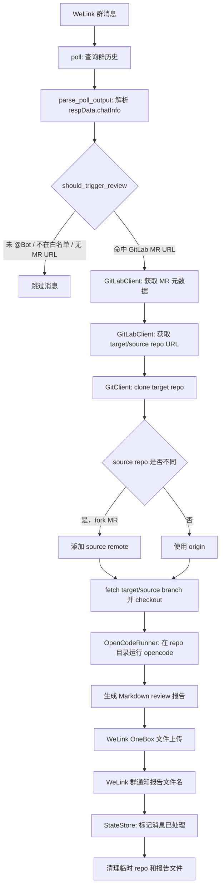
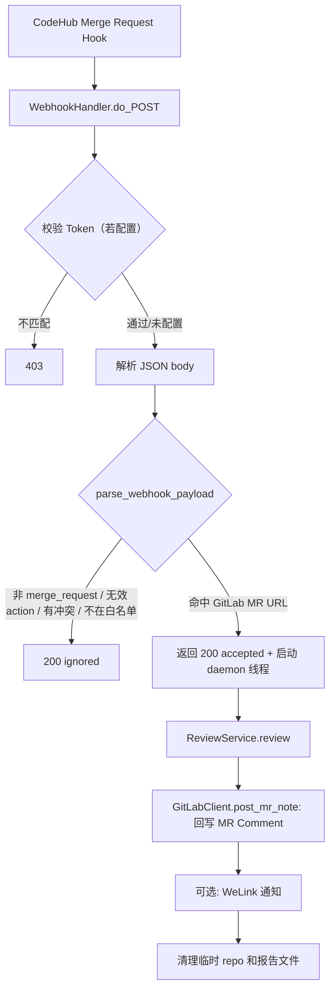

# 设计方案图

本项目有两条核心路径：

1. **IM 轮询路径**：从 WeLink 群消息中识别 GitLab MR URL，触发 review。
2. **Webhook 路径**：接收 CodeHub Merge Request Hook 事件，触发 review。

两条路径共享同一套 `ReviewService` review 管线（GitLab API → clone → diff → opencode → Markdown 报告）。

## IM 轮询路径

## Webhook 路径

## 模块边界

- `cli.py`：命令入口、轮询循环、webhook 子命令、WeLink 上传与通知编排。
- `im.py`：WeLink 历史消息解析、字段归一化、触发条件判断。
- `gitlab.py`：GitLab MR URL 解析、MR 元数据与项目 clone URL 查询、MR Comment 回写。
- `git.py`：临时 clone、fork remote 处理、分支 fetch、checkout、diff 与资源限制。
- `reviewer.py`：串联 GitLab、Git 和 opencode 的 review 主流程。
- `opencode.py`：opencode CLI 调用、debug 参数、prompt 日志脱敏。
- `state.py`：本地去重状态文件，避免重复处理同一条 IM 消息。
- `webhook.py`：HTTP 服务器，接收 CodeHub Merge Request Hook → 解析 payload → 触发 review → 回写 MR Comment。
