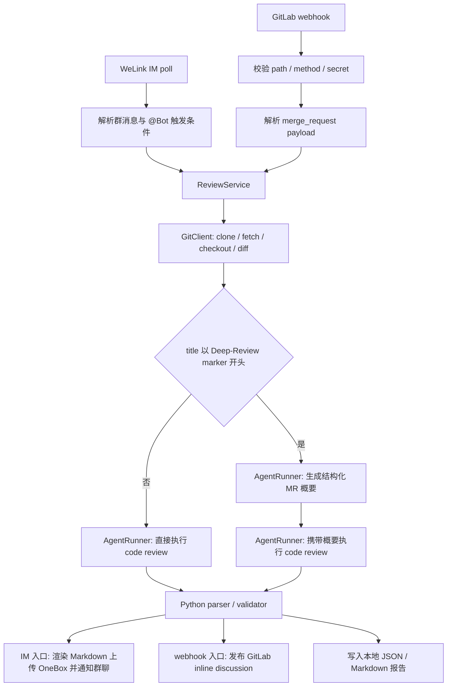
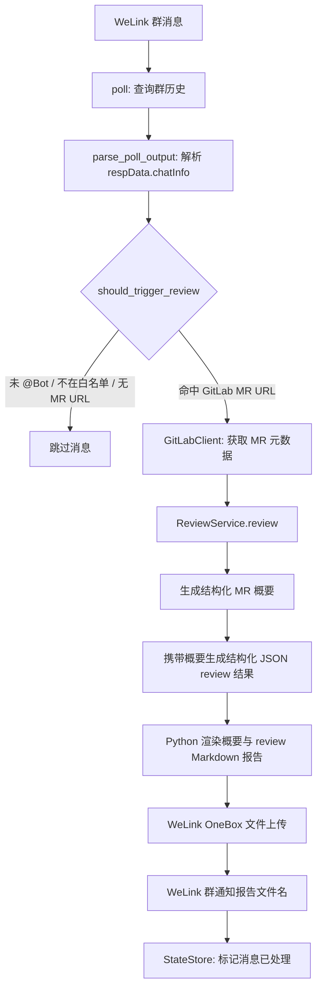

# 设计方案图

本项目有两类触发入口：WeLink IM poll 和 GitLab webhook。入口负责接收事件、过滤不可处理请求，然后把 GitLab MR 信息交给共用的 review core。review core 负责 clone/fetch/checkout、生成 diff，并根据最新 MR title 路由：普通 MR 执行 one-step review；`【Deep-Review】` 前缀执行 two-step。Python 侧再负责校验、inline 发布或 Markdown 渲染。

## 总体结构



## WeLink IM poll 流程



## GitLab webhook 流程


## 结构化 Review 契约

自动入口的两步都要求 Agent 只输出 JSON，不输出 Markdown 或代码围栏。第一步概要严格包含 `overview`、`change_areas`、`behavior_changes`、`risk_areas`、`test_changes`；第二步把该概要作为只读上下文，生成下面的结构化 finding。概要进入本地 JSON/Markdown 报告，但不进入 GitLab comment/discussion；webhook 只发布可定位 finding 的 inline discussion，`run-once` 和 WeLink poll 渲染包含两步结果的 Markdown 报告。

顶层结构：

```json
{
  "findings": [
    {
      "rule_id": "SQL_PERFORMANCE",
      "severity": "major",
      "confidence": "HIGH",
      "old_path": "src/example.py",
      "new_path": "src/example.py",
      "old_line": -1,
      "new_line": 42,
      "title": "批量查询缺少数量限制",
      "evidence": "本次变更新增 IN 查询，但未限制集合大小。",
      "suggestion": "限制集合大小或拆批查询。"
    }
  ],
  "notes": [],
  "test_gaps": []
}
```

字段约束：

- `severity` 使用 GitLab discussions API 枚举：`suggestion`、`minjor`、`major`、`fatal`。
- `confidence` 只能是 `HIGH`、`MEDIUM`、`LOW`。
- 新增行使用 `old_line=-1`；删除行使用 `new_line=-1`。
- `old_path` / `new_path` 使用 GitLab diff 中的路径；重命名时分别填旧路径和新路径。
- `evidence` 和 `suggestion` 必须非空，否则 finding 不进入发布候选。

## Inline 发布规则

webhook 发布前会读取 GitLab MR 详情 API 的 `diff_refs.base_sha`、`diff_refs.start_sha`、`diff_refs.head_sha`，并基于 MR diff 构建可评论行集合。本地 `merge-base` 只用于 clone/diff fallback，不作为 inline discussion position 的权威来源。

默认只发布 `fatal` / `major` 且 `confidence=HIGH` 的 finding。其它 finding、无法映射到 diff 行的 finding、缺少证据或建议的 finding，只进入本地 JSON / Markdown 报告。

发布前会读取远端 discussions 中的 marker，避免重复 webhook 触发时刷屏。marker 格式：

```markdown
<!-- ai-cr:finding:{project}:{mr_iid}:{head_sha}:{rule_id}:{old_path}:{new_path}:{old_line}:{new_line} -->
```

`MR_REVIEWER_WEBHOOK_POST_COMMENT=false` 时不发布 inline discussion，但仍生成本地报告。webhook 不再通过 notes API 提交整段 Markdown note。

## 本地报告与失败策略

webhook 每次 review 都写入同 stem 的机器可读 JSON 监视报告和人类可读 Markdown 报告：

```text
log/webhook-reports/20260709T120000Z-team_project-mr-7-webhook-abc123.json
log/webhook-reports/20260709T120000Z-team_project-mr-7-webhook-abc123.md
```

失败策略：

- 概要生成或校验失败：停止第二步，写 `failure_stage=summary` 的失败态报告。
- 第二次 Agent 调用失败：保留已完成概要，写 `failure_stage=review` 的失败态报告。
- JSON parse failed：不发布 inline discussion，写 `parse_failed` 报告，并在 Markdown 中保留脱敏后的原始输出。
- finding 全部被过滤：不发布 inline discussion，写成功态本地报告。
- 读取远端 discussions 失败：不发布新 discussion，避免失去幂等后刷屏。
- 单条 discussion POST 失败：记录该 finding failed，继续处理其它 finding。
- Markdown 报告写入失败：任务标记 failed，因为本地 Markdown 报告是 webhook 可观测性的一部分。

## 模块边界

MR Web URL 与 REST API root 是两个独立边界：`MR_REVIEWER_GITLAB_BASE_URL` 只用于 URL host 校验，`MR_REVIEWER_GITLAB_API_BASE_URL` 持有包含版本前缀的完整 API root；`GitLabClient` 只追加 `/projects/...` 资源路径。

- `cli.py`：命令入口、轮询循环和 review service 装配。
- `welink.py`：WeLink poll/reply 命令执行、OneBox 上传与群通知编排。
- `webhook.py`：GitLab webhook HTTP handler、secret 校验、payload 解析、后台队列、inline discussion 发布编排和本地报告写入。
- `im.py`：WeLink 历史消息解析、字段归一化、触发条件判断。
- `gitlab.py`：GitLab MR URL 解析、MR 元数据、MR 详情 diff_refs、项目 clone URL 查询、discussions 读取与 inline discussion 发布。
- `git.py`：临时 clone、fork remote 处理、分支 fetch、checkout、diff 与资源限制。
- `reviewer.py`：共用 review core，串联 GitLab、Git 和 two-step Agent 调用，并管理两步共享的任务超时预算。
- `review_result.py` / `inline_review.py` / `markdown_report.py`：概要与 review JSON 解析、finding 行定位校验、GitLab inline 发布结果整理和本地 Markdown 报告渲染。
- `opencode.py`：AgentRunner protocol、OpenCode/Claude Code adapter、debug 参数和 prompt 日志脱敏。
- `state.py`：IM poll 的本地去重状态文件，避免重复处理同一条 IM 消息。
