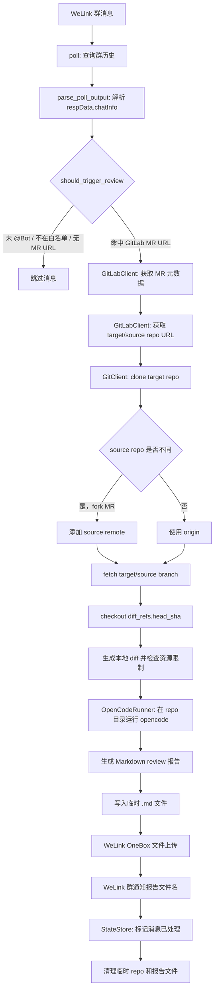

# 设计方案图

本项目的核心路径是：从 WeLink 群消息中识别 GitLab MR URL，在临时目录 clone 并拉取 MR 的 target/source 分支，然后在本地仓库目录调用 opencode 生成 Markdown review 报告，最后上传报告文件并发送群通知。

## 模块边界

- `cli.py`：命令入口、轮询循环、WeLink 上传与通知编排。
- `im.py`：WeLink 历史消息解析、字段归一化、触发条件判断。
- `gitlab.py`：GitLab MR URL 解析、MR 元数据与项目 clone URL 查询。
- `git.py`：临时 clone、fork remote 处理、分支 fetch、checkout、diff 与资源限制。
- `reviewer.py`：串联 GitLab、Git 和 opencode 的 review 主流程。
- `opencode.py`：opencode CLI 调用、debug 参数、prompt 日志脱敏。
- `state.py`：本地去重状态文件，避免重复处理同一条 IM 消息。
