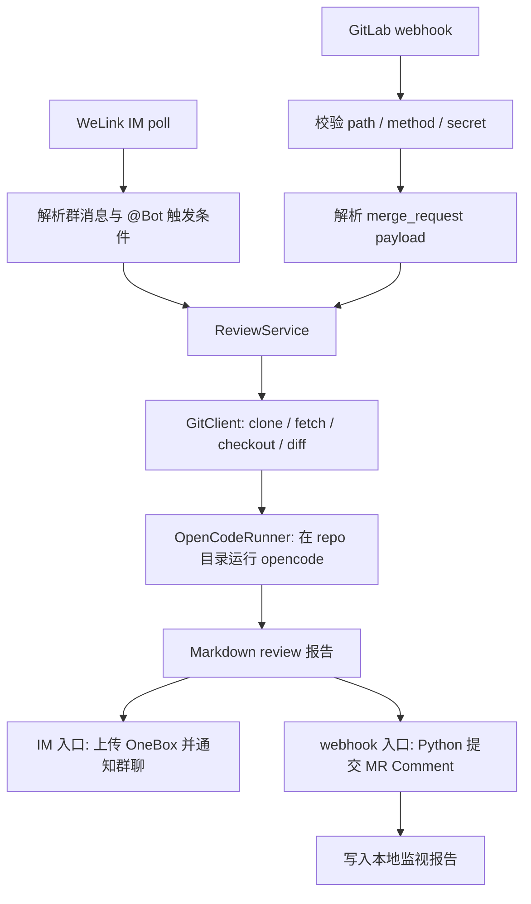
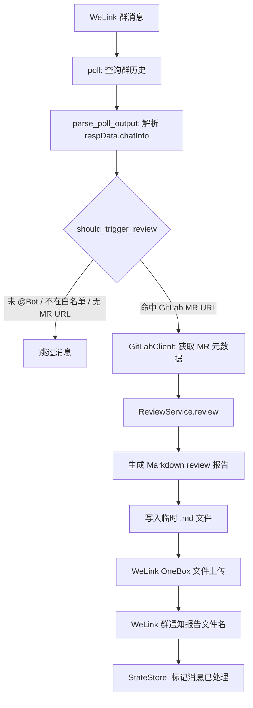
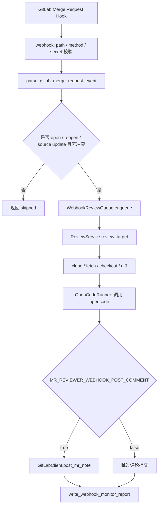

# 设计方案图

本项目有两类触发入口：WeLink IM poll 和 GitLab webhook。入口负责接收事件、过滤不可处理请求，然后把 GitLab MR 信息交给共用的 review core。review core 负责 clone/fetch/checkout、生成 diff、调用 opencode，并返回 Markdown review 报告。

## 总体结构

## WeLink IM poll 流程

## GitLab webhook 流程

## 模块边界

- `cli.py`：命令入口、轮询循环和 review service 装配。
- `welink.py`：WeLink poll/reply 命令执行、OneBox 上传与群通知编排。
- `webhook.py`：GitLab webhook HTTP handler、secret 校验、payload 解析、后台队列、Python comment 提交编排和本地监视报告。
- `im.py`：WeLink 历史消息解析、字段归一化、触发条件判断。
- `gitlab.py`：GitLab MR URL 解析、MR 元数据、项目 clone URL 查询与 MR Comment 提交。
- `git.py`：临时 clone、fork remote 处理、分支 fetch、checkout、diff 与资源限制。
- `reviewer.py`：共用 review core，串联 GitLab、Git 和 opencode。
- `opencode.py`：opencode CLI 调用、debug 参数、prompt 日志脱敏。
- `state.py`：IM poll 的本地去重状态文件，避免重复处理同一条 IM 消息。
