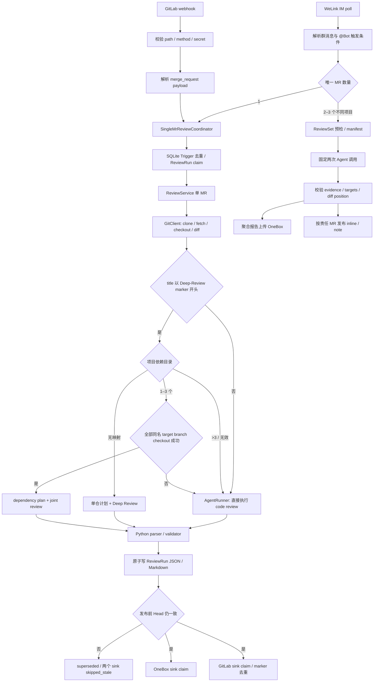
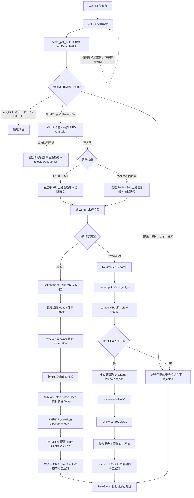
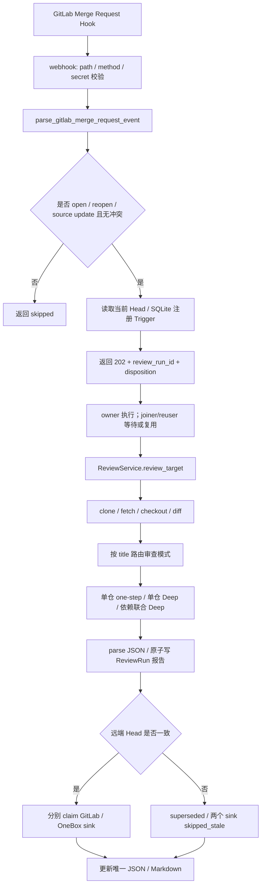

# 设计方案图

本项目有两类触发入口：WeLink IM poll 和 GitLab webhook。单 MR 请求先由共享 `SingleMrReviewCoordinator` 读取 GitLab 当前 Head，再按 `(project_path, mr_iid, head_sha)` 注册 ReviewRun；相同版本只执行一次成功 review，所有 Trigger 的 GitLab/OneBox 意图按 sink 合并并各交付至多一次。Review core 负责 clone/fetch/checkout、diff 和 title/catalog 路由。WeLink IM 的 2–3 MR ReviewSet 继续走独立 two-step 路径，不进入 ReviewRun 协调层。Python 是本地报告、GitLab 和 OneBox 外部写入的唯一所有者。

## 总体结构


```mermaid
flowchart TD
    A["WeLink IM poll"] --> B["解析群消息与 @Bot 触发条件"]
    C["GitLab webhook"] --> D["校验 path / method / secret"]
    D --> E["解析 merge_request payload"]
    B --> B2{"唯一 MR 数量"}
    B2 -- "1" --> S["SingleMrReviewCoordinator"]
    B2 -- "2–3 个不同项目" --> R["ReviewSet 预检 / manifest"]
    E --> S
    S --> C1["SQLite Trigger 去重 / ReviewRun claim"]
    C1 --> F["ReviewService 单 MR"]
    F --> G["GitClient: clone / fetch / checkout / diff"]
    G --> H{"title 以 Deep-Review marker 开头"}
    H -- "否" --> I["AgentRunner: 直接执行 code review"]
    H -- "是" --> Q{"项目依赖目录"}
    Q -- "无映射" --> H2["单仓计划 + Deep Review"]
    Q -- "1–3 个" --> Q2{"全部同名 target branch checkout 成功"}
    Q -- ">3 / 无效" --> I
    Q2 -- "否" --> I
    Q2 -- "是" --> Q3["dependency plan + joint review"]
    I --> J["Python parser / validator"]
    H2 --> J
    Q3 --> J
    J --> M["原子写 ReviewRun JSON / Markdown"]
    M --> V{"发布前 Head 仍一致"}
    V -- "否" --> X["superseded / 两个 sink skipped_stale"]
    V -- "是" --> K["OneBox sink claim"]
    V -- "是" --> L["GitLab sink claim / marker 去重"]
    R --> R2["固定两次 Agent 调用"]
    R2 --> R3["校验 evidence / targets / diff position"]
    R3 --> R4["聚合报告上传 OneBox"]
    R3 --> R5["按责任 MR 发布 inline / note"]
```

## WeLink IM poll 流程


```mermaid
flowchart TD
    A["WeLink 群消息"] --> B["poll: 查询群历史"]
    B -. "按间隔持续查询，不等待 review" .-> B
    B --> C["parse_poll_output: 解析 respData.chatInfo"]
    C --> D{"resolve_review_trigger"}
    D -- "未 @Bot / 不在白名单 / 无 MR URL" --> E["跳过消息"]
    D -- "单 MR / 合法 ReviewSet" --> Q["in-flight 占位 + 有界 FIFO admission"]
    Q -- "等待队列已满" --> QX["成员明确的暂未受理通知 + rejected/queue_full"]
    Q -- "已入队" --> QT{"请求类型"}
    QT -- "1 个唯一 MR" --> A1["发送单 MR 已受理通知 + 位置快照"]
    QT -- "2–3 个不同项目" --> A2["发送 ReviewSet 已受理通知 + 位置快照"]
    A1 --> W["单 worker 串行消费"]
    A2 --> W
    W --> WT{"消费请求类型"}
    WT -- "单 MR" --> F["GitLabClient: 获取 MR 元数据"]
    WT -- "ReviewSet" --> R["ReviewSetPreparer"]
    D -- "数量 / 项目 / 仓库不合法" --> X["成员明确的安全拒绝文案 + rejected"]
    F --> F2["读取当前 Head / 注册 Trigger"]
    F2 --> G["ReviewRun owner 执行；joiner 等待"]
    G --> H["按 title 路由审查模式"]
    H --> H2["单仓 one-step / 单仓 Deep / 依赖联合 Deep"]
    H2 --> I["原子写 ReviewRun JSON/Markdown"]
    I --> J["按 IM sink 配置 claim OneBox/GitLab"]
    J --> K["发送带 MR / Head / sink 状态的终态通知"]
    K --> L["StateStore: 标记消息已处理"]
    R --> R2["project path -> project_id"]
    R2 --> R3["isource MR: diff_refs + ReqID"]
    R3 --> R4{"ReqID 非空且一致"}
    R4 -- "否" --> X
    R4 -- "是" --> R5["多成员精确 checkout + review-set.json"]
    R5 --> R6["review-set-plan/v1"]
    R6 --> R7["review-set-review/v1"]
    R7 --> R8["聚合报告 + 责任 MR 发布"]
    R8 --> R9["OneBox 上传 + 成员明确的终态通知"]
    R9 --> L
    X --> L
```

## ReviewSet 契约与发布

ReviewSet 根目录固定为：

```text
<task-root>/
  review-set.json
  members/p<project-id>-mr<iid>/repo/
```

`project_id` 必须通过 MR URL 中的 project path 查询，`iid` 只取自 URL；生产 MR 详情读取 `/projects/{project_id}/isource/merge_requests/{iid}`。`ReqID` 只接受 `e2e_issues[0].issue_num` 的 trim 后非空字符串。manifest 包含 `schema_version`、完整 SHA-256 `review_set_id`、`req_id` 和成员 project/iid/base/start/head/repo path；成员顺序不影响 ID，head 变化会生成新 ID。

Agent 的第一阶段输出 `review-set-plan/v1`，第二阶段输出 `review-set-review/v1`。最终 finding 可以引用多个成员证据和多个责任 target，但 Agent 不能提供可信 URL、project id、SHA 或 marker。Python 在发布前校验全部 evidence/target：未知成员、越界路径或非法行号记为 `invalid`；合法位置不在当前 diff 时回退为普通 MR note。

IM/webhook 单 MR 与 ReviewSet 共用 `FindingPublicationPolicy`。默认发布 `minor` 及以上且 `confidence=HIGH` 的 target；部署侧可通过 `MR_REVIEWER_PUBLISH_MIN_SEVERITY` 与 `MR_REVIEWER_PUBLISH_MIN_CONFIDENCE` 调整，门槛只影响发布候选，不过滤报告 findings。marker 由 ReviewSet ID、规范化 evidence、rule 和 target 计算；分页读取 discussions 时，individual note 也参与去重。单目标 POST 失败不回滚其它已发布目标，状态转为 `success_with_warnings`。`MR_REVIEWER_REVIEW_SET_POST_COMMENT=false` 时只生成报告并把候选记为 `disabled`；开关开启但 `MR_REVIEWER_AGENT_MODEL_NAME` 为空时不发布，状态为 `success_with_warnings`。

聚合报告 basename 固定为 `review-set-<review_set_id 前 12 位>.md`，包含 ReqID、成员 refs、计划、关系结论、所有 findings、证据、责任位置和逐 target 发布状态。JSON 保留机器可读的原始 `status`/`reason`；单 MR 和 ReviewSet Markdown 通过同一 formatter 转为安全中文原因，未知组合不暴露内部枚举，发布异常也不写入报告。任务状态限定为 `rejected`、`failed`、`success` 或 `success_with_warnings`；OneBox 上传失败把已完成任务提升为 `success_with_warnings`。拒绝和运行失败都以成员明确的安全 IM 文案终结原消息，不自动重试。

## 单 MR 项目依赖联合检视

部署侧通过可选 `MR_REVIEWER_REPOSITORY_DEPENDENCY_CATALOG` 提供严格 JSON 目录，schema 为 `schema_version=1` 和 `repositories[]`。每项只包含唯一 `project_path` 与去重、非自身的直接 `dependencies[]`；不解析 Maven/POM/GAV/version，也不递归依赖仓映射。

只有 `【Deep-Review】` 或 `[Deep-Review]` 单 MR 读取目录。1–3 个依赖形成联合候选；超过 3 个、目录不可读/schema 非法或任一依赖 project/branch/checkout 失败时，删除全部依赖上下文并执行单仓 one-step。未配置目录或当前项目无映射不是失败，继续单仓 two-step。普通 MR 和 ReviewSet 均不读取目录。

依赖 project path 先通过 GitLab project API 转为不含凭据的 HTTPS clone URL。每个依赖 workspace 从空仓开始，只 fetch `refs/heads/<主 MR target_branch>` 到固定本地 ref，使用 `--no-tags --no-recurse-submodules --refmap=`，再 detached checkout 解析出的 commit SHA；不得 fallback source branch、默认分支、tag 或近似 ref。全部成功后写入 `dependency-review/v1` manifest，`context_id` 由主 MR head SHA 与排序后的依赖 project/commit 计算。

联合模式在 task root 固定调用两次 Agent：`dependency-review-plan/v1` 只规划主 MR 变更与已证实依赖契约；`dependency-review-result/v1` 的 evidence repo ID 只能来自 manifest。`primary` 表示主仓，依赖仓没有 MR range、不得执行 diff，也不能成为 finding target。Python 不分析 package、import、FQCN 或 changed path 来筛选依赖，相关性由 Agent 阅读主 MR diff 后判断。结果适配为现有单 MR finding 后，只进入主 MR 原有 inline 校验与发布路径。

## GitLab webhook 流程


```mermaid
flowchart TD
    A["GitLab Merge Request Hook"] --> B["webhook: path / method / secret 校验"]
    B --> C["parse_gitlab_merge_request_event"]
    C --> D{"是否 open / reopen / source update 且无冲突"}
    D -- "否" --> E["返回 skipped"]
    D -- "是" --> F["读取当前 Head / SQLite 注册 Trigger"]
    F --> F2["返回 202 + review_run_id + disposition"]
    F2 --> G["owner 执行；joiner/reuser 等待或复用"]
    G --> G2["ReviewService.review_target"]
    G2 --> H["clone / fetch / checkout / diff"]
    H --> I["按 title 路由审查模式"]
    I --> I2["单仓 one-step / 单仓 Deep / 依赖联合 Deep"]
    I2 --> J["parse JSON / 原子写 ReviewRun 报告"]
    J --> K{"远端 Head 是否一致"}
    K -- "否" --> M["superseded / 两个 sink skipped_stale"]
    K -- "是" --> L["分别 claim GitLab / OneBox sink"]
    L --> N["更新唯一 JSON / Markdown"]
    M --> N
```

## 结构化 Review 契约

自动入口要求 Agent 的整体输出是一个 JSON 对象，不得用 Markdown 或代码围栏包裹 JSON。普通 MR 和单仓 Deep Review 沿用单 MR finding；依赖联合 Deep 使用独立 `dependency-review-plan/v1` / `dependency-review-result/v1`，允许 evidence 引用 manifest 中主仓或依赖仓，但 position 与唯一责任目标只能是主 MR。两类 Deep Review 的第一阶段生成严格计划，第二阶段必须重新验证、允许推翻并覆盖计划遗漏。计划进入本地 JSON/Markdown 报告，但不进入 GitLab comment/discussion。仅当 suggestion 包含可靠的具体代码时，允许在 JSON 字符串内部使用带语言标识的普通 Markdown fenced code block；当前契约不生成需要精确替换范围的 GitLab `suggestion` block。

`structured_output.py` 是模型输出的统一信任边界。单 MR、ReviewSet 与 dependency review 的 plan/result 都先对完整输出执行 `json.loads`；完整 JSON 的 schema 校验失败时立即拒绝，不扫描其内部对象。只有整段发生 `JSONDecodeError` 时，解析器才用 `JSONDecoder.raw_decode` 枚举外层 JSON object，并以调用方原有完整契约逐个校验：恰好一个有效对象时恢复，没有有效对象或多个有效对象时拒绝。该边界不修复单引号、尾逗号、截断 JSON、字段、类型或枚举，也不触发 Agent retry，因此各 review 模式的调用次数不变。恢复日志只记录输出类型、前后缀字符数和候选数；`structured_parse_status` 仍只有 `success` / `failed`。

便携式 `gitlab-mr-review` skill 不能依赖项目安装，因此脚本内保留等价的自包含解析与完整契约校验。恢复后的 review 会重新序列化为纯 JSON 再提交 Notes API，本地 Markdown 也只从已校验对象渲染；无效或歧义输出在 comment 提交前 fail-closed。

顶层结构：

```json
{
  "findings": [
    {
      "rule_id": "SQL_PERFORMANCE",
      "severity": "major",
      "confidence": "HIGH",
      "old_path": "src/example.py",
      "new_path": "src/example.py",
      "old_line": -1,
      "new_line": 42,
      "title": "批量查询缺少数量限制",
      "evidence": "本次变更新增 IN 查询，但未限制集合大小。",
      "suggestion": "限制集合大小或拆批查询。"
    }
  ],
  "notes": [],
  "test_gaps": []
}
```

字段约束：

- `severity` 使用 GitLab discussions API 枚举：`suggestion`、`minor`、`major`、`fatal`。
- `confidence` 只能是 `HIGH`、`MEDIUM`、`LOW`。
- 新增行使用 `old_line=-1, new_line=N`；删除行使用 `old_line=N, new_line=-1`。
- diff 中未修改的上下文行同时提供该位置匹配的 `old_line` 和 `new_line`；两者必须命中同一个上下文位置。
- 两个行号表示一个 GitLab diff 位置，不是范围的开始与结束。`0`、小于 `-1`、双 `-1`，以及任一侧命中 diff 但两侧无法对应同一个上下文位置的组合通常均非法，不发布也不回退普通 note。单 MR 仅兼容一种已知模型误报：更新文件的 `old_line=new_line=N` 同时精确命中旧侧删除行和新侧新增行时，规范为新侧位置 `old_line=-1, new_line=N`。该容错不改变 Agent 输出契约，也不用于新文件、范围式行号或 ReviewSet。
- `old_path` / `new_path` 使用 GitLab diff 中的路径；重命名时分别填旧路径和新路径。
- `evidence` 和 `suggestion` 必须非空，否则 finding 不进入发布候选。

## Discussion 展示契约

普通单 MR 与 ReviewSet 发布共用“证据优先”的信息层级：

1. 标题以 `🤖 AI Review` 标识来源；ReviewSet 额外标明类型。标题不重复平台已经展示的 severity，也不展示模型名。
2. 正文依次展示“判断依据”“影响”“建议”。单 MR 直接展示 finding evidence；ReviewSet 按成员、文件和行区间分项展示 evidence refs。
3. suggestion 中的普通 Markdown fenced code block 原样交给 GitLab 渲染。
4. confidence、rule、模型名以及 ReviewSet issue/type 放入 `<details>` 的“审查信息”折叠区。
5. Python 生成的幂等 marker 继续作为不可见 HTML comment 放在正文末尾，其计算和去重语义不受展示格式影响。

## Inline 发布规则

单 MR Trigger 注册前会读取 GitLab MR 详情中的当前 Head；外部交付前再次读取并比较 ReviewRun Head。版本不一致时，GitLab 与 OneBox 都记为 `skipped_stale`，不执行写入。GitLab sink 还会读取 `diff_refs.base_sha`、`diff_refs.start_sha`、`diff_refs.head_sha` 并基于 MR diff 构建可评论行集合。本地 `merge-base` 只用于 clone/diff fallback，不作为 inline discussion position 的权威来源。

发布门槛按固定顺序比较：severity 为 `suggestion < minor < major < fatal`，confidence 为 `LOW < MEDIUM < HIGH`；默认最低值分别是 `minor` 和 `HIGH`。配置值必须使用现有枚举，非法值在 `Config` 初始化时失败。`healthcheck` 输出实际门槛。低于任一门槛的 finding 分别标记 `below_min_severity` 或 `below_min_confidence`。

IM/webhook 单 MR 仅发布同时满足门槛并能映射到规范 diff 位置的 finding。低于门槛、无法映射到 diff 行、缺少证据或建议的 finding 只进入本地 JSON / Markdown 报告；不会为了发布而借用邻近变更行。ReviewSet 对语法合法但不在当前 diff 的位置继续回退普通 note，自相矛盾或非法位置不回退。

SQLite 先按 `(review_run_id, sink)` 事务 claim GitLab sink，再读取远端 discussions marker，避免 IM/webhook 并发或崩溃重试刷屏。marker 格式：

```markdown
<!-- ai-cr:finding:{project}:{mr_iid}:{head_sha}:{rule_id}:{old_path}:{new_path}:{old_line}:{new_line} -->
```

单 MR 的 IM/webhook GitLab 开关独立；任一 Trigger 开启时，该 ReviewRun 可执行一次 GitLab sink。两个入口都关闭时不发布 inline discussion，但仍生成本地报告。两个入口都不通过 notes API 提交整段 Markdown note。

已知限制：单 MR 的高风险、高置信非 diff finding 当前仍只保留本地。未来可以评估将其回退为普通 MR note，但本次设计未开放 Notes API，也未承诺具体启用条件。

## 本地报告与失败策略

IM/webhook 的每个单 MR ReviewRun attempt 都写一组机器可读 JSON 和人类可读 Markdown；多个 Trigger 不复制完整报告：

```text
log/webhook-reports/20260904T120000Z-team_project-mr-7-a1b2c3d4e5f6-review-abc123.json
log/webhook-reports/20260904T120000Z-team_project-mr-7-a1b2c3d4e5f6-review-abc123.md
```

JSON schema `single-mr-review-run/v1` 包含 `review_run_id`、ReviewKey、attempt、`review_status`、`superseded_by`、全部 Trigger、两个 delivery 状态和 `head_validation`，同时保留原 review/routing/finding/failure 字段。成功 OneBox 文件名固定为 `review-<project>-mr-<iid>-<head12>-<run-id>.md`。规范报告首次写入失败会阻止全部外部交付并释放 review lease。

SQLite 使用 WAL、`busy_timeout` 与 `BEGIN IMMEDIATE` claim。ReviewRun 为 `queued/running/succeeded/failed/interrupted/superseded`；成功结果可复用，失败类状态由同 SHA 新 Trigger 创建下一 attempt。全局一次只允许一个 running ReviewRun。启动只把过期 lease 标为 `interrupted`，不会从 SQLite 恢复完整任务。新 SHA 会原子标记同 MR 旧未完成 run 的 `superseded_by`；旧 Agent 不强杀，而是在安全检查点协作停止。

delivery 彼此独立：一个 sink 失败不阻塞另一个，整体返回 `success_with_warnings`。GitLab 明确失败可重试，并依赖 marker 消除崩溃后的重复 finding。OneBox 明确失败可由后续 Trigger 重试；上传中断的 lease 记为 `unknown` 且不自动重试，因为 CLI 没有已验证的服务端幂等键。

IM poll 主线程只执行查询、解析、本地拒绝、in-flight 去重、受理通知和入队；单个 `ImReviewWorker` 串行消费单 MR 与 ReviewSet，因此 Agent 最大并发仍为 1。`MR_REVIEWER_IM_MAX_PENDING_REVIEWS` 默认 20，只限制等待数，不包含当前执行项。容量判断使用 worker 接管条件同步，避免同批首个请求尚未 dequeue 时误拒绝后续请求。队列位置是 admission 瞬间的快照，包含当前运行和更早入队的 IM 请求，不包含 webhook 或其它进程，也不表示 ETA。

IM poll 在合法请求进入 GitLab 或 Agent I/O 前发送“已受理”，终态重复携带 `project_path!iid`、MR URL、可用的 Head SHA、finding 总数及严重级别分布、每个 sink 的结果和跟踪ID；零 finding 不省略这些身份与交付字段。单 MR 的 `joined`、`reused`、`duplicate` 会显式呈现 ReviewRun 协调语义；ReviewSet 终态列出全部成员、ReqID 和 ReviewSet ID。跟踪ID关联日志、State JSON、SQLite ReviewRun 和本地报告，不承担查询接口语义。`StateStore` 使用进程内 `RLock` 串行化读取、entry 更新与原子替换，并在原消息 entry 中分别记录受理和终态通知结果。排队和执行中的 message ID 只保存在带锁的 in-flight map；终态成功持久化后才移除，进程强制终止后依靠历史查询重放。

常驻 poll 查询异常或正常退出时停止接收新任务，并 drain 全部已受理任务；`poll --once` 同样等待该批终态。worker 对每个业务任务隔离异常并继续 FIFO；若终态 State 写入失败，则仅记录安全 `error_type`，停止后续 admission，并让 poll 非零退出。accepted 与 terminal 发送共用互斥锁，避免并发启动多个 `welink-cli`。

通知 renderer 内部继续使用真实换行。`welink.py` 仅在 reply command 的首个可执行文件直接解析为 `welink-cli[.cmd|.ps1|.exe]` 时，把 CRLF/CR/LF 统一编码为字面量 `\n` 后传给 CLI；Windows、PowerShell 和 POSIX 使用同一参数语义，自定义 reply command 保持真实换行。IM transport 没有已验证的幂等键，因此发送失败不自动重试，也不改写真实 review 状态。

失败策略：

- 审查计划生成或校验失败：停止第二步，写 `failure_stage=review_plan` 的失败态报告。
- Deep Review 第二次 Agent 调用失败：保留已完成计划，写 `failure_stage=review` 的失败态报告。
- 依赖联合计划或 review 失败：分别写 `failure_stage=dependency_review_plan` / `dependency_review`，保留 `requested_review_mode`、实际 `review_mode`、依赖 project/branch/commit 与准备耗时，并清理整个任务目录。
- 依赖目录、数量或准备失败：不属于任务失败；报告 `dependency_context_status=degraded` 和稳定 reason，明确“未执行依赖联合检视”，再执行单仓 one-step。
- JSON 无法解析、没有契约有效对象或存在多个契约有效对象：不发布 inline discussion，写 `parse_failed` 报告，并在 Markdown 中保留脱敏后的原始输出。
- finding 全部被过滤：不发布 inline discussion，写成功态本地报告。
- 读取远端 discussions 失败：不发布新 discussion，避免失去幂等后刷屏。
- 单条 discussion POST 失败：记录该 finding failed，继续处理其它 finding。
- 规范 JSON 或 Markdown 报告写入失败：任务标记 failed，且禁止 GitLab/OneBox 外部交付。
- review 成功但某个 sink 失败：不重跑 Agent，只允许后续 Trigger 重试该 sink；另一个 sink 不受影响。
- ReviewSet 任一预检、checkout、计划、review 或结构化解析失败：不进入 GitLab 发布；发送安全 IM 失败文案并将原消息标记 `failed`。
- ReviewSet 单个 target 发布失败：保留其它发布结果，在唯一聚合报告中记录失败并标记 `success_with_warnings`。
- IM 受理或终态发送失败：记录 `stage=im_notify` 的 event/outcome 和 StateStore notification 状态；继续或保留真实 review 结果，不重跑 Agent。
- IM 等待队列已满：不发送受理通知，不调用 GitLab/Agent；发送一次成员明确的“暂未受理”，写入 `rejected/queue_full`，相同消息不自动重试。
- IM 终态 State 写入失败：作为 poll 基础设施故障停止 admission 并非零退出；不把已完成 review 改写为业务失败，也不追加第二条终态。

## 模块边界

MR Web URL 与 REST API root 是两个独立边界：`MR_REVIEWER_GITLAB_BASE_URL` 只用于 URL host 校验，`MR_REVIEWER_GITLAB_API_BASE_URL` 持有包含版本前缀的完整 API root；`GitLabClient` 只追加 `/projects/...` 资源路径。完整接口目录、消费字段和模式调用矩阵见 [GitLab API 说明](GITLAB_API.md)。

- `cli.py`：命令入口、持续轮询、有界 FIFO worker、in-flight admission、review service 装配和 IM Trigger 通知。
- `im_notifications.py`：单 MR / ReviewSet 受理、完成、告警、过期、失败和拒绝文案的纯渲染。
- `coordination.py`：SQLite ReviewRun/Trigger/delivery 状态、lease、事务 claim、去重、复用与 supersede。
- `single_mr.py`：IM/webhook 单 MR 统一编排、协作取消、报告先行和 sink 协调。
- `delivery.py`：共享 GitLab Head 安全门槛、finding 校验、marker 去重与 discussion 发布。
- `review_artifacts.py`：ReviewRun 级 JSON/Markdown 的确定性路径、原子写入与成功结果加载。
- `welink.py`：WeLink poll/send 命令执行和 OneBox 单文件上传 transport。
- `webhook.py`：GitLab webhook HTTP handler、secret/事件校验、202 协调字段和内存后台队列；保留未接协调器时的兼容测试路径。
- `im.py`：WeLink 历史消息解析、字段归一化，以及忽略/单 MR/ReviewSet/拒绝四态触发判断。
- `gitlab.py`：GitLab MR URL 解析、project path 到 project id 查询、MR/isource MR 元数据、项目 clone URL、分页 discussions、inline discussion 与普通 note API。
- `git.py`：临时 clone、fork remote 处理、分支 fetch、checkout、diff 与资源限制。
- `repository_dependencies.py`：严格项目依赖目录 loader、Deep Review 候选路由与 one-step 降级决策。
- `dependency_review.py`：依赖 project 元数据校验、同名 target branch 精确 checkout、all-or-nothing 清理与 `dependency-review.json` manifest。
- `dependency_review_result.py`：联合 plan/result 严格 schema、manifest repo/path/line 校验与单 MR finding 适配。
- `review_set.py`：ReviewSet 预检、ReqID/refs 信任边界、确定性 manifest 与多成员 workspace。
- `review_set_result.py` / `review_set_publish.py` / `review_set_report.py`：联合 plan/result 严格解析、责任 target 校验/幂等发布和聚合 Markdown。
- `reviewer.py`：共用 review core，串联 GitLab、Git 和 Agent；单仓 Deep、依赖联合 Deep 与 ReviewSet 的 two-step 均共享各自任务剩余超时预算。
- `structured_output.py` / `result_validation.py` / `review_result.py` / `inline_review.py` / `publication_policy.py` / `markdown_report.py`：结构化输出恢复边界、严格结果字段校验、审查计划与 review JSON 契约校验、finding 行定位校验、共享发布门槛、GitLab inline 发布结果整理和本地 Markdown 报告渲染。
- `opencode.py`：AgentRunner protocol、OpenCode/Claude Code 机器可读事件 adapter、顶层会话完整文本提取、tool/sub-agent 输出隔离、协议 fail-closed、debug 参数和 prompt 日志脱敏。
- `state.py`：IM poll 的本地去重状态文件，同时记录受理和终态通知是否发送成功。
